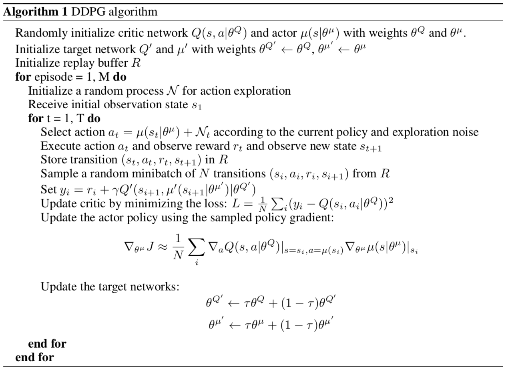

# Continuous-Control
Using deep reinforcement learning to control virtual robotic arms

### Introduction

 
The environment for this project involves controlling a double-jointed arm to reach the moving target location. A reward of +0.1 is provided for each step that the agent's hand is in the goal location, and so the agent is rewarded for keeping its arm inside the moving target location. The observation space consists of 33 variables corresponding to position, rotation, velocity, and angular velocities of the arm. Each action is a vector with four numbers, corresponding to torque applicable to two joints. Every entry in the action vector should be a number between -1 and 1. There are two versions of this Unity environment. The first version contains a single agent. The second version contains 20 identical agents, each with its own copy of the environment. The environment is considered solved when the average (over 100 episodes) of those average scores is at least +30. To achieve this, I used a deep deterministic policy gradient.

##### Deep Deterministic Policy Gradient Algorithm [Lillicrap et al]
##### [Source Paper](https://arxiv.org/abs/1509.02971)

### Initialization
1.) Download the desired version

Version 1: One (1) Agent
Linux: [click here](https://s3-us-west-1.amazonaws.com/udacity-drlnd/P2/Reacher/one_agent/Reacher_Linux.zip)
Mac OSX: [click here](https://s3-us-west-1.amazonaws.com/udacity-drlnd/P2/Reacher/one_agent/Reacher.app.zip)
Windows (32-bit): [click here](https://s3-us-west-1.amazonaws.com/udacity-drlnd/P2/Reacher/one_agent/Reacher_Windows_x86.zip)
Windows (64-bit): [click here](https://s3-us-west-1.amazonaws.com/udacity-drlnd/P2/Reacher/one_agent/Reacher_Windows_x86_64.zip)

Version 2: Twenty (20) Agents
Linux: [click here](https://s3-us-west-1.amazonaws.com/udacity-drlnd/P2/Reacher/Reacher_Linux.zip)
Mac OSX: [click here](https://s3-us-west-1.amazonaws.com/udacity-drlnd/P2/Reacher/Reacher.app.zip)
Windows (32-bit): [click here](https://s3-us-west-1.amazonaws.com/udacity-drlnd/P2/Reacher/Reacher_Windows_x86.zip)
Windows (64-bit): [click here](https://s3-us-west-1.amazonaws.com/udacity-drlnd/P2/Reacher/Reacher_Windows_x86_64.zip)

(For Windows users) Check out [this link](https://support.microsoft.com/en-us/help/827218/how-to-determine-whether-a-computer-is-running-a-32-bit-version-or-64) if you need help with determining if your computer is running a 32-bit version or 64-bit version of the Windows operating system.

(For AWS) If you'd like to train the agent on AWS (and have not [enabled a virtual screen](https://github.com/Unity-Technologies/ml-agents/blob/master/docs/Training-on-Amazon-Web-Service.md)), then please use [this link](https://s3-us-west-1.amazonaws.com/udacity-drlnd/P2/Reacher/one_agent/Reacher_Linux_NoVis.zip) (version 1) or [this link](https://s3-us-west-1.amazonaws.com/udacity-drlnd/P2/Reacher/Reacher_Linux_NoVis.zip) (version 2) to obtain the "headless" version of the environment. You will not be able to watch the agent without enabling a virtual screen, but you will be able to train the agent. (To watch the agent, you should follow the instructions to [enable a virtual screen](https://github.com/Unity-Technologies/ml-agents/blob/master/docs/Training-on-Amazon-Web-Service.md), and then download the environment for the Linux operating system above.)

2.) Create (and activate) a new environment with Python 3.6, enter the following in the terminal:

Linux or Mac:
#
conda create --name drlnd python=3.6
source activate drlnd
#
Windows:
#
conda create --name drlnd python=3.6 
activate drlnd
#

3.) Clone the repository and navigate to the python/ folder. Then, install several dependencies:
#
git clone https://github.com/udacity/deep-reinforcement-learning.git
cd deep-reinforcement-learning/python
pip install .
#

4.) Create an IPython kernel for the drlnd environment:
#
python -m ipykernel install --user --name drlnd --display-name "drlnd"
#

5.) Before running code in a notebook, change the kernel to match the drlnd environment by using the drop-down Kernel menu:

### Implementation

I used a deep deterministic policy gradient. You can see my implentation in the file [Continuous_Control.ipynb](https://github.com/brand909/Continuous-Control/blob/master/Continuous_Control.ipynb) and you can read my report in the file [report.md](https://github.com/brand909/Continuous-Control/blob/master/report.md).

Some good papers on algorithms that can be used to solve environments with many agents:

[PPO](https://arxiv.org/pdf/1707.06347.pdf)

[A3C](https://arxiv.org/pdf/1602.01783.pdf)

[D4PG](https://openreview.net/pdf?id=SyZipzbCb)

[It has been shown](https://ai.googleblog.com/2016/10/how-robots-can-acquire-new-skills-from.html) that having multiple copies of the same agent sharing experience can accelerate learning.

