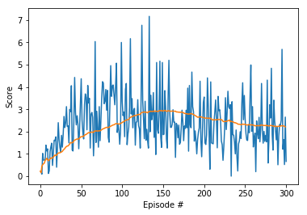
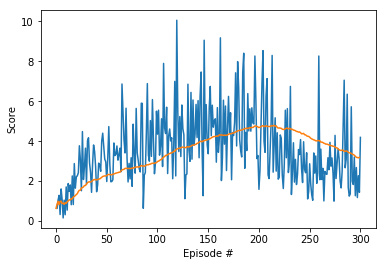
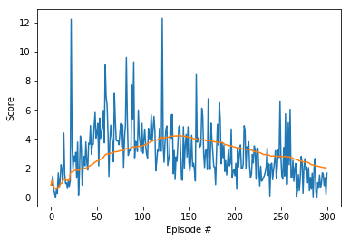
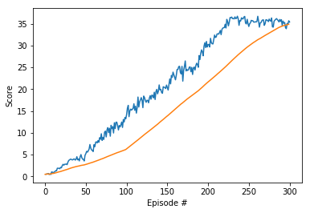

### Deep Deterministic Policy Gradients (DDPG) Applied to the Reacher Environment

DDPG is an actor-critic algorithm that uses different levels of noise to simulate stochasticity. The actor can be seen as a policy that tries to maximize its return using gradient ascent, while the critic tells the actor how well it is doing. Both the actor and the critic approximate values using their respective neural networks, with target neural networks that slowly blend in these approximations by some measure, usually very small, labeled hyperperameter tau. Both actor and critic each have a target neural networks that is used as a baseline to train their regular, or 'local', neural networks. For the this specific project, the noise settings will be what's examined the most:

def sample(self):

  x = self.state
  
  dx = self.theta * (self.mu - x) + self.sigma * np.array([random.random() for i in range(len(x))])
  
  self.state = x + dx
  
  return self.state

I began by trying to train a single agent under various noise settings. Under every setting, the agent destabilized after
a brief period of learning. The first agent I trained was under the base noise settings, with theta = 0.15 and sigma = 0.2.

The second time, I tried to altered the noise settings by increasing theta to 0.75 and decreasing sigma to 0.1.

The third time, theta was set to 0.3, a small increase from the original noise settings, and sigma was kept at the original 
0.2

Though it still failed like the others, the variance that the noise distribution caused looked more promising. There are 
several points on the plot where it looks as if the agent has discovered some new policy that it wants to build on and 
transition to. It reaches higher than the other two noise settings before falling off. I then used these noise settings to
train 20 agents simultaneously. In order to make room for the twentyfold experience tuples that would be coming in, the replay buffer size was increased and so was minibatch size that the agent samples from to learn. The code was also changed so that the neural networks updated 10 times every 20 timesteps, instead of updating after every timestep, which would be, with 20 agents, updating 20 times at every timestep.

This was successful. Even though each individual arm is ikely to destabilize and fail at several points during training, as a group they share experience and the noisy learning of the individual becomes smoothed out as a whole. This is why choosing the noise settings that caused the agent to try to reach high and then fail was able to work. Now, it's as if when an agent tries to be very exploratory and finds itself in danger, there are other agents giving advice on perhaps a similar situation that they encountered, feeding that experience into the neural network. 

The learn rates, tau, and neural networks were fairly standard, with the learn rates (actor = 0.003 critic = 0.006) and tau (0.001) being very small, and the neural networks each having two hidden layers of 250x150. Gradient clipping was used for stability. In the future, I'd like to experience with different levels of tau and learn rates to see if I can train a single agent in this environment without unstable learning.
